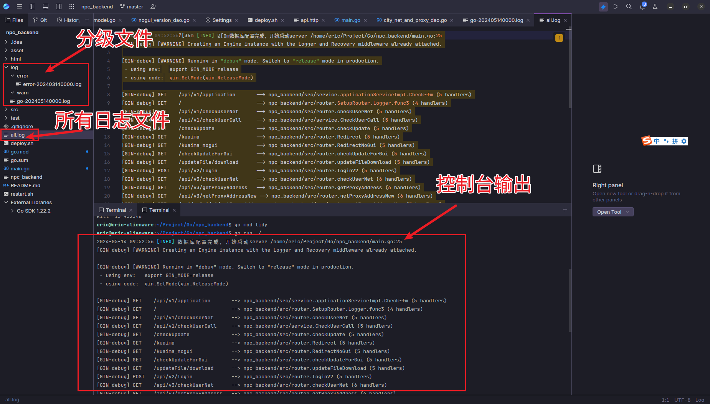
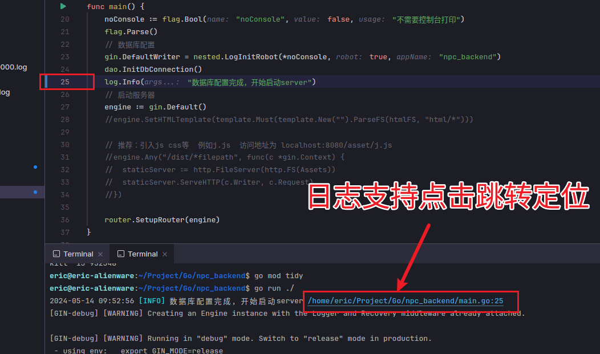
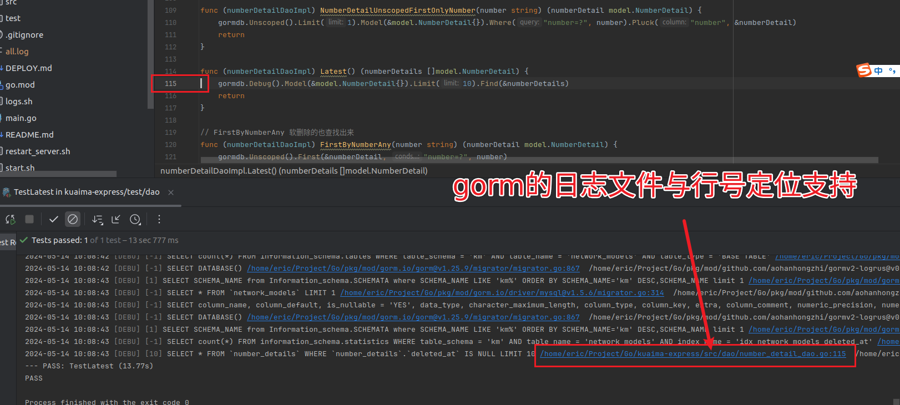
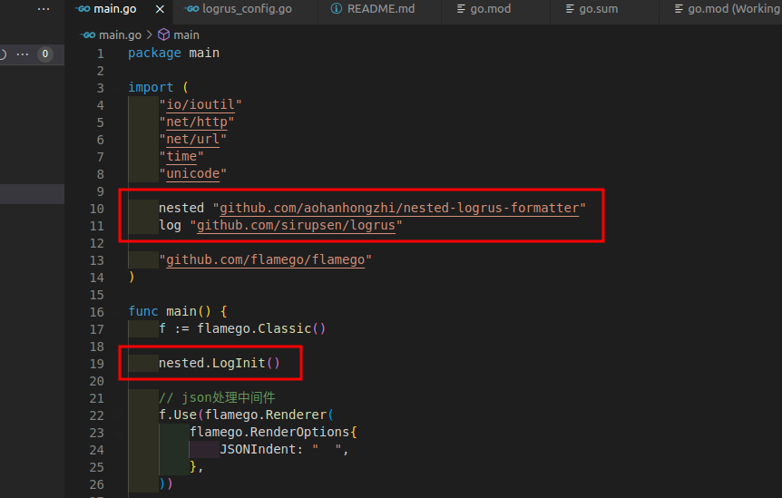
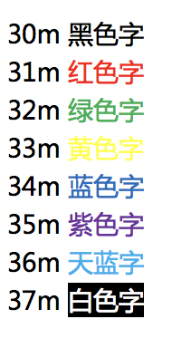

# nested-logrus-formatter

https://github.com/aohanhongzhi/nested-logrus-formatter

[](https://travis-ci.org/antonfisher/nested-logrus-formatter)
[](https://goreportcard.com/report/github.com/antonfisher/nested-logrus-formatter)
[](https://godoc.org/github.com/aohanhongzhi/nested-logrus-formatter)

## 主要功能

1. 控制台输出与文件写入
2. 日志文件与行号定位，支持跳转
2. 支持GORM的日志接管，适配其日志的打印。github.com/aohanhongzhi/gormv2-logrus
3. 邮件报警
4. 飞书报警
5. http机器人报警

### 控制台输出与文件写入



### 日志文件与行号定位，支持跳转



### 支持GORM的日志接管，适配其日志的打印。

https://github.com/aohanhongzhi/gormv2-logrus

这里注意一个点，本来下面这行查询语句并不是日志记录语句，而是通过特殊栈查找，打印的该文件和行号，这样方便GORM定位与调试。



# 代码介绍

Human-readable log formatter, converts _logrus_ fields to a nested structure:


## Configuration:

```go
type Formatter struct {
	// FieldsOrder - default: fields sorted alphabetically
	FieldsOrder []string

	// TimestampFormat - default: time.StampMilli = "Jan _2 15:04:05.000"
	TimestampFormat string

	// HideKeys - show [fieldValue] instead of [fieldKey:fieldValue]
	HideKeys bool

	// NoColors - disable colors
	NoColors bool

	// NoFieldsColors - apply colors only to the level, default is level + fields
	NoFieldsColors bool

	// NoFieldsSpace - no space between fields
	NoFieldsSpace bool

	// ShowFullLevel - show a full level [WARNING] instead of [WARN]
	ShowFullLevel bool

	// NoUppercaseLevel - no upper case for level value
	NoUppercaseLevel bool

	// TrimMessages - trim whitespaces on messages
	TrimMessages bool

	// CallerFirst - print caller info first
	CallerFirst bool

	// CustomCallerFormatter - set custom formatter for caller info
	CustomCallerFormatter func(*runtime.Frame) string
}
```

## Usage

```go
import (
	nested "github.com/antonfisher/nested-logrus-formatter"
	"github.com/sirupsen/logrus"
)

log := logrus.New()
log.SetFormatter(&nested.Formatter{
	HideKeys:    true,
	FieldsOrder: []string{"component", "category"},
})

log.Info("just info message")
// Output: Jan _2 15:04:05.000 [INFO] just info message

log.WithField("component", "rest").Warn("warn message")
// Output: Jan _2 15:04:05.000 [WARN] [rest] warn message
```

See more examples in the [tests](./tests/formatter_test.go) file.

## Development

```bash
# run tests:
make test

# run demo:
make demo
```

```
GOPROXY=https://goproxy.cn,direct
或者
GOPROXY=https://goproxy.io,direct
```

# 新的使用方式

```go
	nested "github.com/aohanhongzhi/nested-logrus-formatter"
	log "github.com/sirupsen/logrus"

    //手动初始化下就好了
    nested.LogInit(true)
```



```go
	// -noConsole=true 在启动命令行加上这个，就可以实现线上不需要控制台输出，本地开发需要控制台。
	noConsole := flag.Bool("noConsole", false, "开发环境")
	flag.Parse()
	// 数据库配置
	gin.DefaultWriter = nested.LogInit(*noConsole)
```

## 配合gin使用

```go
    gin.DefaultWriter = nested.LogInit(true)
```

## 配合gorm使用

github.com/aohanhongzhi/gormv2-logrus

```go
	gormLogger := gormv2logrus.NewGormlog(gormv2logrus.WithLogrus(logrus.StandardLogger()))
	gormLogger.LogMode(logger.Warn)
	gormConfig := &gorm.Config{
		Logger: gormLogger,
		NamingStrategy: schema.NamingStrategy{
			TablePrefix:   "tb_",
			SingularTable: true,
		},
	}

	// 数据库配置
	var err error
	dsn := "username:password@tcp(mysq.host.com:3306)/km?charset=utf8mb4&parseTime=True&loc=Local"
	Gormdb, err = gorm.Open(
		mysql.New(mysql.Config{
			DSN:               dsn,
			DefaultStringSize: 256,
		}), gormConfig)
	if err != nil {
		panic("failed to connect database")
	}
	Gormdb.AutoMigrate(&model.NPCComputerInfo{})
```

# 输出颜色




# 强制指定版本

```shell
 go mod tidy -go=1.19
```

# 发布

```shell
git tag v1.5.2
git push --tags 
```

# 本地调试

```go.mod
replace github.com/aohanhongzhi/nested-logrus-formatter => /home/eric/Project/Go/nested-logrus-formatter
```

## Tag 专属日志

为不改变现有接口，新增可选能力：启用后，任一包含字段 `tag` 的日志将被“旁路”写入 `./log/tag/<tag>.log`，原有日志流保持不变。

```go
nested.LogInitWithLevel(false, "my-app", log.DebugLevel)
// 开启 tag 旁路写入能力
nested.EnableTagFileRouter()

// 任意位置打印带 tag 的日志
log.WithField("tag", "orders").Info("created order #1")
log.WithField("tag", "orders").Error("order failed")
// 也可以使用其他 tag
log.WithField("tag", "book").Warn("book warn")
```

说明：
- tag 文件路径：`<初始化dir>/log/tag/<tag>.log`
- 滚动策略（大小、保留天数、备份数）与主日志一致
- 异步写入，低开销；程序退出时会自动 Flush（也可手动调用 `formatter.FlushAsyncHooks()`）

## GORM 错误邮件报警

为配合GORM数据库操作，新增可选的GORM错误邮件报警功能。当GORM产生错误日志时，会自动发送邮件报警。

```go
nested.LogInitWithLevel(false, "my-app", log.DebugLevel)

// 启用GORM错误邮件报警（需要有效的邮件服务器配置）
err := nested.EnableGormErrorMail(
    "my-app",           // 应用名称
    "smtp.qq.com",      // SMTP服务器
    587,                // 端口
    "sender@qq.com",    // 发件人
    "alert@qq.com",     // 收件人
    "sender@qq.com",    // 用户名
    "password",         // 密码/授权码
)
if err != nil {
    log.Errorf("启用GORM错误邮件报警失败: %v", err)
}

// 后续的GORM错误会自动发送邮件
// 例如: gorm日志 "Error 1406 (22001): Data too long for column..."
```

### 控制开关

```go
// 检查是否已启用
enabled := nested.IsGormErrorMailEnabled()

// 临时禁用
nested.DisableGormErrorMail()

// 重新启用（如果之前创建过Hook）
if globalHook := nested.GetGormErrorMailHook(); globalHook != nil {
    globalHook.Enable = true
}
```

说明：
- 自动检测GORM错误日志特征（包含"[Error "和gormv2-logrus调用栈）
- 只针对Error、Fatal、Panic级别日志
- 邮件包含完整的错误信息、调用栈和时间戳
- 可随时开启/关闭，不会影响正常日志输出