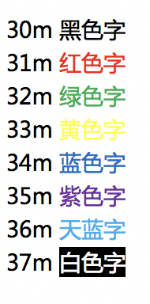

# nested-logrus-formatter

[](https://travis-ci.org/antonfisher/nested-logrus-formatter)
[](https://goreportcard.com/report/github.com/antonfisher/nested-logrus-formatter)
[](https://godoc.org/github.com/antonfisher/nested-logrus-formatter)

Human-readable log formatter, converts _logrus_ fields to a nested structure:


## Configuration:

```go
type Formatter struct {
	// FieldsOrder - default: fields sorted alphabetically
	FieldsOrder []string

	// TimestampFormat - default: time.StampMilli = "Jan _2 15:04:05.000"
	TimestampFormat string

	// HideKeys - show [fieldValue] instead of [fieldKey:fieldValue]
	HideKeys bool

	// NoColors - disable colors
	NoColors bool

	// NoFieldsColors - apply colors only to the level, default is level + fields
	NoFieldsColors bool

	// NoFieldsSpace - no space between fields
	NoFieldsSpace bool

	// ShowFullLevel - show a full level [WARNING] instead of [WARN]
	ShowFullLevel bool

	// NoUppercaseLevel - no upper case for level value
	NoUppercaseLevel bool

	// TrimMessages - trim whitespaces on messages
	TrimMessages bool

	// CallerFirst - print caller info first
	CallerFirst bool

	// CustomCallerFormatter - set custom formatter for caller info
	CustomCallerFormatter func(*runtime.Frame) string
}
```

## Usage

```go
import (
	nested "github.com/antonfisher/nested-logrus-formatter"
	"github.com/sirupsen/logrus"
)

log := logrus.New()
log.SetFormatter(&nested.Formatter{
	HideKeys:    true,
	FieldsOrder: []string{"component", "category"},
})

log.Info("just info message")
// Output: Jan _2 15:04:05.000 [INFO] just info message

log.WithField("component", "rest").Warn("warn message")
// Output: Jan _2 15:04:05.000 [WARN] [rest] warn message
```

See more examples in the [tests](./tests/formatter_test.go) file.

## Development

```bash
# run tests:
make test

# run demo:
make demo
```

```
GOPROXY=https://goproxy.cn,direct
或者
GOPROXY=https://goproxy.io,direct
```

# 新的使用方式

```go
	nested "github.com/aohanhongzhi/nested-logrus-formatter"
	log "github.com/sirupsen/logrus"

    //手动初始化下就好了
    nested.LogInit(true)
```


```go
	// -noConsole=true 在启动命令行加上这个，就可以实现线上不需要控制台输出，本地开发需要控制台。
	noConsole := flag.Bool("noConsole", false, "开发环境")
	flag.Parse()
	// 数据库配置
	gin.DefaultWriter = nested.LogInit(*noConsole)
```


## 配合gin使用

```go
	gin.DefaultWriter = nested.LogInit(true)
```

## 配合gorm使用

```go
	gormLogger := gormv2logrus.NewGormlog(gormv2logrus.WithLogrus(logrus.StandardLogger()))
	gormLogger.LogMode(logger.Warn)
	gormConfig := &gorm.Config{
		Logger: gormLogger,
		NamingStrategy: schema.NamingStrategy{
			TablePrefix:   "tb_",
			SingularTable: true,
		},
	}

	// 数据库配置
	var err error
	dsn := "username:password@tcp(mysq.host.com:3306)/km?charset=utf8mb4&parseTime=True&loc=Local"
	Gormdb, err = gorm.Open(
		mysql.New(mysql.Config{
			DSN:               dsn,
			DefaultStringSize: 256,
		}), gormConfig)
	if err != nil {
		panic("failed to connect database")
	}
	Gormdb.AutoMigrate(&model.NPCComputerInfo{})
```

# 颜色



# 发布

```shell
git tag v1.3.9
git push --tags 
```
